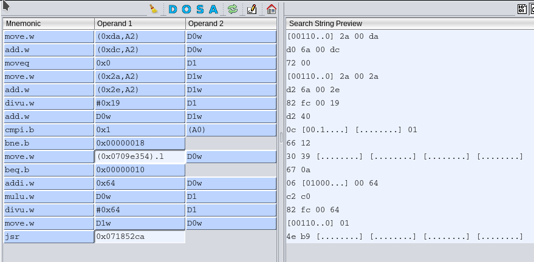
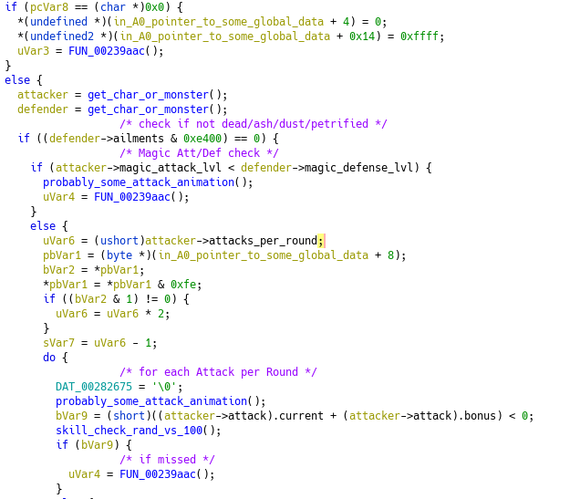

**fs-uae-dump-analyzer**
or: 
# An approach to reverse engineering for old amiga games... #

This repository contains code I wrote to help me find out how some internals of Ambermoon work, as well as this guide on the approach I used, in order to help with this project: https://github.com/Pyrdacor/Ambermoon.net

Note that I did all this on Linux so, while all the important tools should run on Windows and MacOS as well, you might need to improvise on occasion.

##### What you need: #####

* **FS-UAE**, as well as it's **source code** (https://fs-uae.net/download#linux) and whatever is needed to 
build it.
* **Ghidra** (https://ghidra-sre.org)
* the Amiga hunks loader plugin for ghidra (https://github.com/lab313ru/ghidra_amiga_ldr)
* Some **basic knowledge of Assembler** (not necessarily MK68 - I just had some experience with 8085 and MIPS when I started this) and **C**
* The M68K CPU Programmers Reference Manual (https://www.nxp.com/docs/en/reference-manual/M68000PRM.pdf)
* The **rust** compiler and cargo (it's build manager) (https://www.rust-lang.org) to build the dump-analyzer.
* The **unencrypted and uncompressed** executable file(s) of the Game you want to reverse engineer. If you can open the file in a hex editor and find readable strings beyond the first few hundred bytes, it's a good sign and you can continue. Otherwise you might need to use Ghidra to find out how to do that first. Maybe someone has already done it and you can find the clear version on the internet (as was the case for Ambermoon).

##### Optional (for the less important scripts): #####

* python 
* qalc
* WSL (on windows)


##### Contents of this repository #####

* src/ Source for the dump-analyzer
* patch/ patch to make FS-UAE dump info on each cpu instruction
* scripts/ some optional helper scripts (or examples for scripts..)


## Introduction: The What and Why? ##
* FS-UAE is the program I use to run those great Games from the 90s today. It offers the possibility to save and load snapshots of the current memory state, as well as a debug mode. Both are essential to the whole approach.
* Ghidra is a suite of Software reverse engineering tools, developed by the NSA and released as open source in 2019. With the Amiga hunks plugin it is able to disassemble and analyze an amiga executable. It has a lot of useful features to help understand how that executable works.

The approach presented here, uses a slightly modified version of FS-UAE to create a dump of CPU-instruction and the associated data register changes during a specific timeframe. This is then used to find the instructions for a specific functionality, known to be executed during that timeframe, and then use Ghidra to analyze it further (along with the normal FS-UAE's debug mode).

Rust is used to compile a tool for analyzing the instruction dump. Knowledge of ASM and C is needed to understand Ghidra's output.

## Preparations ##

1. Download and install all the stuff mentioned above.

2. Compile modified FS-UAE (just to be clear: you need both, a modified and unmodified fs-uae):
    * unpack source archive
    
    * apply patch and build  
    ```
   cd /path/to/fs-uae.3.0.5 
   patch -p1 < /path/to/fs-uae-dump-analyzer/patch/fs-uae-3.0.5_dump.patch
   ./configure && make
   strip fs-uae
   ```

3. Install the Amiga hunks plugin
    1. start Ghidra
    2. choose File -> Install Extension
    3. click on the plus icon near the top right
    4. choose the plugin (the .zip archive, as downloaded)
    5. make sure "ghidra_amiga_ldr" is checked

4. Compile the dump analyzer in release mode (loading files in <1 vs. 15+ seconds)
    ```
   cd /path/to/fs-uae-dump-analyzer/
   cargo build --release 
   ```
    
5. Set up a working directory and scripts to your liking. 
   * I used a symlink to `/path/to/fs-uae-dump-analyzer/target/release/dump-analyzer` for convenience.
   * FS-UAE (both variants) needs to be started via command line for debug mode to work. A simple `/path/to/fsuae /path/to/configuration` will do that, but you might want to do some extra stuff for dumping. `newdump.sh` and `startamb.sh` in the scripts directory are what I used.
   You also need to append the following line to the config file: 
        ```
        console-debugger = 1
        ```

## Taking a dump ##

Ok.. so let's start with something easy and find the function that determines a readable value. In Ambermoon this would be a damage roll in battle.
  1. Start the modified FS-UAE and redirect its output to a file called `opcode.log`. Writing to a RAM-Disk (tmpfs on linux) may be preferable, but I don't think it's necessary. On Linux you can adapt the `newdump.sh` script to do this.
  2. Get the game started, the press `F12` and **save state**. You should use the save & load state features instead of completely restarting the game, because 1.) it's faster 2.) it ensures that the program is loaded at the same address in memory for all tests, meaning you have to find out the offset between the addresses FS-UAE and Ghidra use only once.
  3. Get to the part in the game, shortly before whatever you want to analyze happens.
  4. Now... **read through the next steps** first, and prepare to press `F12` and the Key, that is `D` on qwert-type keyboard layouts at the right time (e.g. `F12+E` on dvorak). This would normally start the debugger but, in our modified version, will make FS-UAE dump information on every CPU instruction it emulates.
  5. If there is enough timing between triggering the action possible, trigger it. If not and you need to click your mouse to trigger it, move the pointer to the right spot. Then press `F12+E` (or whatever it is on your keyboard). If you need to trigger the action, do it now.
  6. You will notice, that the emulation slows down significantly - that is FS-UAE dumping.
  7. Press your middle mouse button to exit FS-UAE's focus, wait until what you wanted to happen, did happen, note the number and close the FS-UAE window (it won't stop on it's own!).
  8. Wait until your shell is ready again and, if you didn't use my script, move the dump to a directory.
  
Now let's use dump-analyzer..
Assuming in the dump from Ambermoon, Egil did 7 damage to some Monster and you saved it to a directory called `egil_7_dmg`
```
$ ./dump-analyzer d egil_7_dmg 7
00F824DA, @153626 D0: 0 -> 7 
071789EA, @206809 D1: 32001b -> 320007 
07178FE0, @206818 D0: 70a0000 -> 70a0007 
07180D02, @207656 D5: e -> 7 
07180D9A, @208452 D5: e -> 7 
071828DE, @296286 D1: 68 -> 7 
07182986, @296868 D1: 32 -> 7 
0718298A, @296741 D0: 3b -> 7 
071829AE, @296816 D1: fff9 -> 7 
071829C2, @295648 D1: 5 -> 7 
07182E40, @281856 D7: 8 -> 7 
071836A2, @281644 D7: 8 -> 7 
0718388E, @282688 D0: 6 -> 7 
07185384, @283848 D0: 8 -> 7 
07185392, @270730 D0: 6 -> 7 
07185D88, @283728 D0: 6 -> 7 
07185D8A, @283729 D2: 6 -> 7 
07185E5A, @283804 D2: 8 -> 7 
0718614E, @206925 D0: 0 -> 7 
07186C64, @208636 D2: a0014 -> 7 
07186CDA, @208664 D2: ffff -> 7 
0718A4EA, @210652 D0: 8 -> 7 
```

This will show a list of candidates, where that value was finally determined. Each line shows the program counter , followed by the position of the instruction inside the dump and a list of data register changes resulting in the value 7. A change like 32001b -> 320007 might still be 7, because Operations might use just 8 or 16 bits and ignore the rest. Changes at a pc like 00F824DA are usually system calls.

That is still a lot of possibilities, so let's take another dump and reduce this.
This time Valdyn did the attacking and did 6 damage...
```
$ ./dump-analyzer d egil_7_dmg 7 valdyn_6_dmg 6                      
071789EA, @206809 D1: 32001b -> 320007 , @246860 D1: 140016 -> 140006 
07178FE0, @206818 D0: 70a0000 -> 70a0007 , @246869 D0: 70a0005 -> 70a0006 
0718298A, @296741 D0: 3b -> 7 , @369053 D0: 35 -> 6 
07182E40, @281856 D7: 8 -> 7 , @347629 D7: 7 -> 6 
071836A2, @281644 D7: 8 -> 7 , @351467 D7: 7 -> 6 
0718388E, @282688 D0: 6 -> 7 , @347946 D0: 5 -> 6 
07185384, @283848 D0: 8 -> 7 , @357130 D0: 7 -> 6 
07185392, @270730 D0: 6 -> 7 , @344005 D0: 5 -> 6 
07185D88, @283728 D0: 6 -> 7 , @356998 D0: 5 -> 6 
07185D8A, @283729 D2: 6 -> 7 , @356999 D2: 5 -> 6 
07185E5A, @283804 D2: 8 -> 7 , @357087 D2: 7 -> 6 
0718614E, @206925 D0: 0 -> 7 , @246971 D0: 0 -> 6 
07186C64, @208636 D2: a0014 -> 7 , @249329 D2: 7 -> 6 
07186CDA, @208664 D2: ffff -> 7 , @249357 D2: 7 -> 6 
0718A4EA, @297723 D0: 8 -> 7 , @249147 D0: 7 -> 6
```

The results in the middle and the one at the end decrease or increase the value by one, so they are probably for loops. This leaves 6 candidates. We could add more dumps, but for the sake of brevity, lets just jump to the next step: the verification.
What we want to find, is the instruction where the value was actually determined. It makes sense to try them in the order they were executed (number after `@`), because the value could have been saved on the stack and loaded later, before being displayed to the user.

### Verification ###
Now, let's start the **unpatched** FS-UAE with the same configuration and load the same state. Do as before and press `F12+E` (or `F12+D` or whatever) - but this time we're starting the actual debug mode. You'll see something like that:
```
WARNING: Activated debugger
 -- stub -- activate_console 
  D0 07170200   D1 00000000   D2 00000018   D3 1F87000C 
  D4 000000C0   D5 0000FFFF   D6 0000000C   D7 00000094 
  A0 070A8718   A1 00035148   A2 00111B24   A3 0718C28E 
  A4 070AA0D6   A5 070A5AF6   A6 00DFF000   A7 070A5ACE 
USP  070A5ACE ISP  07002270 SFC  00000000 DFC  00000000 
CACR 00000000 VBR  00000000 CAAR 00000000 MSP  00000000 
T=00 S=0 M=0 X=0 N=0 Z=1 V=0 C=0 IMASK=0 STP=0
07180BB8 0828 0000 0011           BTST.B #$0000,(A0, $0011) == $070a8729
Next PC: 07180bbe
>

```
The value above "Next PC:" is the current PC, followed by the Operation to be executed next in hex, followed by a more human-readable interpretation of it. Besides that, the most important values are the register contents, labeled D0-D7 for data registers (where calculations are usually made) and A0-A7 for address registers (pointing to data in memory). A7 is (as far as I know) actually the stack pointer.

To check our first candidate, lets add a breakpoint at it with `f`, then continue with `g`. `?` will show a command summary.
```
>f 071789EA
Breakpoint added
>g
```
Lets trigger the action in game and wait until it stops and the debugger displays something like
```
Breakpoint at 071789EA
```
From the line
```
071789EA, @206809 D1: 32001b -> 320007 , @246860 D1: 140016 -> 140006
```
we know the change occurs in D1 and uses 8 or 16 bit - so let's set it to some unlikely value like 101 and continue with
```
>r D1 00c5
>g
```

if you deal 101 points of damage - great that's the pc :)
if not, back to debug mode, unset the breakpoint, and try the next one. There is a also `fd` command to remove all breakpoints, but it seems broken. You can list active breakpoints with `fl`.
```
>f 71789EA
Breakpoint removed
>f 07178FE0
```

Ok.. so we found the first code location.. what now?

## Analyzing the function ##

There are some options...
* Read the opcode.log, search for the pc and go up from there..
* `./dump-analyzer i egil_7_dmg 71789EA 100 7 0a` will give you a summary of the 100 steps leading to the first occurence of 71789EA in the dump, highlighting values 7 and 0a (all hex).
* `./dump-analyzer s egil_7_dmg 71789EA 100` will print a more compact summary without highlighting. I found this suitable for copying into a text editor and making notes.
* `./dump-analyzer m egil_7_dmg 71789EA 100` (semi-deprecated) will print commands, you can paste into the FS-UAE debugger, to make it dump associated memory, which you can save to a file called `mem` in the directory containing the dump. (remove all the leading `>` first!). This can improve the summaries above a bit - but don't forget that it's just the memory state at the exact time you pasted the commands!I made this before noticing the `S` command, that can dump whole memory ranges to a file. But this may still be useful if you want to view a reduced part of memory in a text editor. `dump-analyzer` can read both this text output and the binary version.

These can help, because you see what actually happened this specific time. For most of the work however, the main tool will now be Ghidra - so start it.
A full guide to Ghidra is outside the scope of this Readme (I guess it's a tutorial by now..), so I just concentrate on the first steps and the things that seemed most useful to me - besides I'm a beginner here myself.

1. Create new project
2. Import a file (shortcut: `I`)
3. Choose the executable file. In case of Ambermoon there were 3. The Ambermoon - loader, AM2_CPU and AM2_BLIT, where AM2_CPU seems to contain all the interesting stuff. My guess is that AM2_BLIT is only used on certain hardware configurations.
4. Format should be "Amiga Executable Hunks loader" - if you can't choose this, the plugin is probably not installed or activated.
5. Open it and say __Yes__ when asked if it should be analyzed (use default values).
6. At this point you can partially (bug reported) turn off the chinese water torture feature in Edit -> Tool Options -> Options -> Listing Fields -> Cursor.

Now we need to find the offset of our function in Ghidra's listing window. But: the offset we found was absolute for the running instance, while the one here relative to the programs address space. To bridge this, we need to find the difference. `dump-analyzer g` can help :)

```
./dump-analyzer g egil_7_dmg 07178A60 20
[........] [........]
302a 00da
d06a 00dc
7200
322a 002a
d26a 002e
82fc 0019
d240
0c10 0001
6612
3039 0709 e354
670a
0640 0064
c2c0
82fc 0064
3001
4eb9 0718 52ca
Negative step not implemented
```
This will try to generate an instruction pattern, starting from 07178A60 including up to 20 instructions. I doesn't matter where we start - but we need a certain amount of output to be specific enough. The command can fail to produce something suitable if there are function calls or loops, but a few tries should produce something good. As an alternative, you could try the disassembly command in the FS-UAE debugger.

In Ghidra, go to Search -> For Instruction Patterns, click the little icon with the pen (next to the house), select Hex mode and paste the part of the output of `./dump-analyzer g` from the first to the last hex value (302a .. 52ca) into that window and click "Apply".

Some of these values (most likely those starting with 0x07) are translated addresses. To find anything, we have to mask them by clicking on them. This should look like this:



Click on "Search All" and a window with (ideally) one search result should show.
Select it, confirm that it matches the instructions. Then subtract its offset from the one found earlier.
```
071789EA - 00238d6c = 6F3FC7E
```
With this value, you can easily convert between the two offset spaces. If qalc is installed, you can adapt `conv_offset.sh` for this.

If you save this to a file `offset` in the dump directory, some commands in `dump-analyzer` will print the translated PC when called with an uppercase letter. For new dumps, use a symlink or copy it there.

Now you're ready to enter the iterative circle of reverse engineering, meaning: 
* make notes in Ghidra
* analyze dumps to find more functions
* revise previous notes

Every step will create more context, making Ghidra's output more clear.

#### Find data chunks in memory ####
To improve your understanding of data access, you can use the `./dump-analyzer M <dir> <data_dir>` command.
Wher `dir` is a directory, containing the memory dump. Both the text variant (filename=`mem`) as well as binary dumps (named as their starting address in hex, e.g. `07000000`) can be used.

First you need to extract the data you want to search for into a directory structure. This should be something like `<data_dir>/filename_of_original_datafile/data_index`, e.g. `AMB/1Icon_gfx.amb/001`

To get a full dump of all interesting memory, get into FS-UAEs debug mode and use
`dm` to get the address space map. This will show something like
```
00000000    2048K/1 =    2048K Chip memory
00200000    8192K/1 =    8192K Fast memory
00A00000     512K/0 =     512K <none>
00A80000    1024K/2 =     512K Kickstart ROM (14E93BCC)
[...]
07000000      16M/1 =      16M RAMSEY memory (low)
08000000     896M/0 =     896M <none>
40000000      16M/1 =      16M Zorro III Fast RAM
41000000    3056M/0 =    3056M <none>
```

Things labeled <none> and ROM won't contain any interesting data, so just save what you need, like this:
```
S /tmp/00000000 00000000 00A00000
S /tmp/07000000 07000000 01000000
S /tmp/40000000 40000000 01000000
```

Then move the files to you `<dir>`. It is important that the file name is the starting address!

With that we can call `./dump-analyzer M mem_battle AMB > dataMap.csv` which creates a nice TAB-separated file, we can open with a Spreadsheet application like libreoffice calc, or a text editor.
```
File        Index   Mem     Translated      Size
1Map_data.amb   193     0x40088484      0x40088484      10338
1Map_data.amb   036     0x40088484      0x40088484      10338
[...]
```
You can use an offset file if you believe something is loaded into fixed locations, but usually the memory locations will be allocated by the OS at runtime. This makes it unsuited for searching in Ghidra, but can be helpful to make sense of the opcode.log / debugger output.

### A quick summary of things I found most useful in the FS-UAE debugger and Ghidra. ###

#### FS-UAE debugger ####
| Syntax | Description | Example |
| :--- | :--- | :--- |
| `?` | show command summary |  |
| `f <address> ` | Add/remove breakpoint. | `f 0718A0B0` |
| `fl` | List breakpoints | |
| `t [instructions]` | Step one or more instructions. | |
| `z` | Step through one instruction (subroutine) | |
| `r <reg> <value>` | Modify CPU register | `r D0 00C4` |
| `dm` | Dump current address space map. | |
| `m <address> [<lines>]` | Memory dump starting at <address> | `m 0718A0B0 4` |
| `S file <address> <length` | Dump memory to file | `S /tmp/07000000 07000000 01000000` |
| `W <address> <values[.x]>` | Write into Amiga memory. | `W 0718A0B2 A4B2` |
| `g [<address>]` | Start execution at the current address or \<address\>. | `g` |

#### Ghidra ####

* **Comment** with `;`, if you have some thoughts on a part of code/data
* **Label** a function or data location with `L` - if you know (or strongly suspect) what it does. This will make the label appear instead of an address everywhere it is called / accessed.
* Define **data structures** via "Data Type Manager" -> \[program name\] -> right click -> New -> Structure, or from data segments with `[`. Then **set data type** with `T` (for data segments) or `Ctrl+L` (for variables).

In time, what you see in Ghidra will look less like a bunch of wild numbers and more like this:



#### And what is that M68K manual good for? ####
The answer is: you can't always rely on the decompiler and should check the opcode!

I had one case, where it showed something like `DAT_0024ACE0 = '\0'`, when the disassembler listing clearly showed, that instead of setting the value to 0, it was set to the value of a neighbouring memory cell. As far as I understand it, that value was initially 0, but would be changed at runtime. Ghidra did not know that, and made a false assumption.

Because of things like this, it is important to understand the M68K opcode and it might be a good idea to figure out a few functions using the summary from `dump-analyzer` and the M68K manual for practice, before moving to Ghidra.

And if you're wondering where PUSH and POP are... in M68K, register states are saved and restored to/from stack with MOVEM.

